# 🔮 Zodiac Card - Personalized NFT Fortunes on Celo

> A Farcaster Mini App that generates personalized Zodiac fortunes and mints them as NFTs on Celo Mainnet.

<div align="center">
  
</div>

## 🌐 Live Deployment

**Network**: Celo Mainnet (Chain ID: 42220)

### 📜 Smart Contract Evolution

#### 🆕 V3 Contracts (Current - Active)
**Deployed**: December 3, 2025

**V3 NFT Contract**:
- **Proxy Address**: `0x3ff2E08339588c594E6155Fd088f9668b2E7c775`
- **Implementation**: `0x3b433190AD6dB27461f6a118AcfcDFfa0E1D491b`
- [View on Celoscan](https://celoscan.io/address/0x3ff2E08339588c594E6155Fd088f9668b2E7c775)
- ✅ **Verified Contract** - Source code publicly available
- Mint Fee: **2.0 CELO** (reduced pricing)
- Royalty: 2.5% (ERC2981)
- Proxy Type: UUPS Upgradeable
- Compiler: Solidity v0.8.20 with 200 optimization runs
- **Status**: ✅ Active - All new mints use this contract
- **Features**: Clean state, dual mint functions, payment tracking

**V3 Payment Contract**:
- **Address**: `0x2e73081c0455a43f99a02d38a6c6a90b4d3b51f3`
- [View on Celoscan](https://celoscan.io/address/0x2e73081c0455a43f99a02d38a6c6a90b4d3b51f3)
- Image Generation Fee: **2.0 CELO**
- **Status**: ✅ Active - All new fortune generations
- **Features**: Gas-free metadata storage, NFT tracking

#### 📦 V2 Contracts (Legacy - Read-Only)
**Deployed**: October-November 2025

**V2 NFT Contract**:
- **Proxy Address**: `0x415Df58904f56A159748476610B8830db2548158`
- [View on Celoscan](https://celoscan.io/address/0x415Df58904f56A159748476610B8830db2548158)
- ✅ **Verified Contract** - Source code publicly available
- Mint Fee: **10.0 CELO**
- **Status**: 🔒 Read-Only - Corrupted state (stuck `_nextTokenId`)
- **Note**: Historical NFTs viewable, new mints disabled

**V2 Payment Contract**:
- **Address**: `0x52e4212bd4085296168A7f880DfB6B646d52Fe61`
- [View on Celoscan](https://celoscan.io/address/0x52e4212bd4085296168A7f880DfB6B646d52Fe61)
- **Status**: 🔒 Read-Only - Legacy payments viewable

#### 🌱 V1 Contracts (Original - Historical)
**Deployed**: October 2025

**V1 NFT Contract**:
- **Address**: [To be documented]
- **Status**: 🔒 Historical - Legacy NFTs viewable in collection
- **Note**: Original implementation, basic minting functionality
- **Project Launch**: October 23, 2025 (Initial framework)

### 🔄 Complete Contract Version Summary

| Version | Type | Address | Status | Mint Fee | Notes |
|---------|------|---------|--------|----------|-------|
| **V3** | NFT Proxy | `0x3ff2E08339588c594E6155Fd088f9668b2E7c775` | ✅ Active | 2.0 CELO | Clean state, dual functions |
| **V3** | NFT Implementation | `0x3b433190AD6dB27461f6a118AcfcDFfa0E1D491b` | ✅ Active | - | UUPS upgradeable |
| **V3** | Payment | `0x2e73081c0455a43f99a02d38a6c6a90b4d3b51f3` | ✅ Active | 2.0 CELO | Gas-free storage |
| **V2** | NFT Proxy | `0x415Df58904f56A159748476610B8830db2548158` | 🔒 Read-Only | 10.0 CELO | Corrupted state |
| **V2** | Payment | `0x52e4212bd4085296168A7f880DfB6B646d52Fe61` | 🔒 Read-Only | 2.0 CELO | Legacy payments |
| **V1** | NFT | [TBD] | 🔒 Historical | [TBD] | Original contract |

> **Backward Compatibility**: The frontend automatically displays NFTs from **all versions** (V1, V2, and V3) in the collection page, ensuring complete historical visibility and access to all your minted fortunes.

## Overview

Zodiac Card is a Farcaster Frame-enabled Mini App deployed on Celo blockchain, designed to revolutionize fortune-telling in the web3 space. Built natively for the Farcaster ecosystem, it leverages Frames for seamless social interactions and Celo's mobile-first blockchain infrastructure for accessible, low-cost transactions using native CELO tokens. The app enables Farcaster users to engage with fortune-telling experiences directly within their social feeds, fostering a unique blend of social engagement and web3 functionality.

As a decentralized application, Zodiac Card combines the power of astrology, NFTs, and AI to create personalized fortune-telling experiences. Users can mint unique NFTs that represent their personalized fortune cards, with each card dynamically generated based on three key elements:
- Their zodiac sign and astrological profile
- Precise birth date and time data
- Real-time celestial alignments and astronomical positions

The integration with Farcaster's social protocol allows users to share their fortune cards, participate in astrological discussions, and build a community around shared cosmic experiences. Through Celo blockchain's mobile-first infrastructure and native CELO payments (18 decimals), users enjoy fast minting processes and minimal transaction costs while maintaining the security and decentralization benefits of a carbon-negative blockchain.

## Features

- 🎴 Mint unique Zodiac Fortune NFTs for **2.0 CELO** (reduced from 10.0 CELO)
- 🔮 AI-powered fortune predictions using OpenAI GPT-4
- 🔐 **Self Protocol Integration** - Privacy-preserving identity verification
  - Zero-knowledge proof verification for date of birth
  - Auto-fill birth information securely from Self app
  - No sensitive data stored on-chain
- ⭐ Multiple Zodiac Systems:
  - Chinese Zodiac (12 animals based on birth year)
  - Western Zodiac (12 signs based on birth date)
  - Vedic Astrology (Nakshatra system)
  - Mayan Calendar (Tzolkin day signs)
- 🌌 Real-time celestial alignment integration
- 💫 Interactive card viewing experience
- 🔄 Secondary market trading capabilities
- 🖼️ Farcaster Frames integration for social sharing
- 🌐 Native Celo blockchain deployment (carbon-negative)
- 💰 Pay with native CELO tokens - **2.0 CELO** per mint (reduced pricing)
- 📱 Optimized for Farcaster Mini App experience
- 🔄 Backward compatible - View all your V1 NFTs in collection

## 🔒 Security

**Status**: ✅ Security Audit Passed

All API keys and private keys are properly protected:
- ✅ No exposed secrets in codebase
- ✅ All sensitive data in `.env` files (gitignored)
- ✅ Proper environment variable usage throughout
- ✅ Zero hardcoded credentials

📄 See [SECURITY_AUDIT.md](SECURITY_AUDIT.md) for full audit report.

## Tech Stack

- **Frontend**: Next.js 15, React 19, TypeScript
- **Styling**: Tailwind CSS, Shadcn UI, Radix UI
- **Blockchain**: Solidity ^0.8.20, Hardhat, Celo Network
- **Web3**: Viem v2, Wagmi v2
- **AI/ML**: OpenAI GPT-4
- **Privacy**: Self Protocol (Zero-Knowledge Proofs)
  - @selfxyz/core - Backend verification
  - @selfxyz/qrcode - Frontend SDK
- **Storage**: IPFS (Pinata), AWS S3
- **Authentication**: Farcaster Frame SDK, Wallet Connect
- **Testing**: Hardhat Test, OpenZeppelin Test Helpers
- **Farcaster**: Frames SDK v0.0.34

## Architecture


## Workflow

### Complete User Journey (V3 Architecture)

```mermaid
sequenceDiagram
    actor User
    participant FC as Farcaster App
    participant UI as Zodiac Card UI
    participant SELF as Self Protocol
    participant API as Backend API
    participant Flux as Replicate Flux Pro
    participant S3 as AWS S3
    participant PayV3 as Payment Contract V3
    participant IPFS as IPFS/Pinata
    participant NFTV3 as NFT Contract V3
    participant Divvi as Divvi Protocol
    participant BS as Blockscout

    Note over User,BS: Step 1: Authentication & Data Collection
    User->>FC: Open Zodiac Card Mini App
    FC->>UI: Launch App
    UI->>User: Display Fortune Form

    alt Self Protocol Flow (Optional)
        User->>SELF: Scan QR Code with Self App
        SELF->>API: Send ZK Proof (DOB)
        API-->>UI: Auto-fill Birth Date
    else Manual Entry
        User->>UI: Manually Enter Birth Details
    end

    Note over User,BS: Step 2: Fortune Generation (2.0 CELO)
    User->>UI: Click "Generate Fortune"
    UI->>PayV3: createImagePayment() + 2.0 CELO
    PayV3-->>UI: Return paymentId

    UI->>API: /api/generate-fortune (paymentId, birthData)
    API->>Flux: Generate AI Image
    Flux-->>S3: Store Image
    S3-->>API: Image URL

    API->>API: Create Fortune Metadata JSON
    API->>IPFS: Upload Generation Metadata
    IPFS-->>API: IPFS Hash (metadata URI)

    API->>PayV3: storeGenerationMetadata(paymentId, metadataURI)
    PayV3-->>API: Metadata Stored ✅
    API-->>UI: Fortune Generated ✅

    Note over User,BS: Step 3: NFT Minting (2.0 CELO)
    User->>UI: Click "Mint NFT"
    UI->>API: /api/upload-to-ipfs (fortune data)
    API->>IPFS: Upload NFT Metadata
    IPFS-->>API: NFT Metadata URI

    UI->>NFTV3: mintFromImagePayment(to, metadataURI, paymentId) + 2.0 CELO
    Note over NFTV3: Auto-increment tokenId
    NFTV3->>IPFS: Link Metadata URI
    NFTV3->>Divvi: Track Referral (dataSuffix)
    NFTV3-->>UI: Emit NFTMinted(tokenId, uri, paymentId)

    UI->>PayV3: markAsMinted(paymentId, tokenId)
    PayV3-->>UI: Marked as Minted ✅

    UI-->>User: Display Minted NFT Card

    Note over User,BS: Step 4: View Collection
    User->>UI: Navigate to Collection
    UI->>BS: Fetch NFT Transfers (V3 Contract)
    BS-->>UI: V3 NFT List
    UI->>BS: Fetch NFT Transfers (V2 Contract)
    BS-->>UI: V2 NFT List (Legacy)

    loop For Each NFT
        UI->>IPFS: Fetch Metadata by tokenURI
        IPFS-->>UI: NFT Metadata JSON
    end

    UI-->>User: Display Complete Collection (V2 + V3)
```



## Project Structure

```
zodiac-card/
├── ZodiacCardApp/         # Next.js 15 application
│   ├── app/              # App directory
│   │   ├── api/         # API routes (fortune, image, IPFS, S3)
│   │   ├── components/  # React components
│   │   ├── fortune/     # Fortune generation pages
│   │   └── result/      # NFT result display
│   ├── lib/             # Utility functions
│   ├── providers/       # Wagmi providers
│   └── public/          # Static assets
└── ZodiacCardContracts/ # Smart contract monorepo
    └── packages/
        └── hardhat/      # Hardhat development environment
            ├── contracts/     # Smart contract source files (ZodiacNFT.sol)
            ├── deploy/        # Deployment scripts
            ├── test/          # Contract test files
            └── hardhat.config.ts  # Celo network configuration
```

## Smart Contracts

The smart contracts for Zodiac Card are organized in a monorepo structure under `ZodiacCardContracts/`. This setup allows for better organization and separation of concerns between the frontend application and blockchain components.

### Contract Architecture

The smart contracts are developed using Hardhat and deployed on Celo network:

- **ZodiacNFT.sol**: ERC721 upgradeable NFT contract with ERC2981 royalties (2.5%)
- **Payment**: Native CELO tokens (18 decimals) via payable minting
- **Storage**: IPFS integration for metadata storage
- **Upgradeability**: UUPS proxy pattern for future enhancements
- **Events**: NFTMinted, MintFeeUpdated, TreasuryAddressUpdated
- **Access Control**: Ownable pattern for admin functions

### Development Environment

The contracts are set up with a robust development environment including:

- Hardhat for development, testing, and deployment
- TypeScript support for type-safe development
- Automated testing setup
- Deployment scripts for multiple networks
- Environment variable configuration
- Code quality tools (ESLint, Prettier)

### Getting Started with Contracts

1. Navigate to the contracts directory
```bash
cd ZodiacCardContracts/packages/hardhat
```

2. Install dependencies
```bash
yarn install
```

3. Set up environment variables
```bash
cp .env.example .env
```

4. Compile contracts
```bash
yarn compile
```

5. Run tests
```bash
yarn test
```

6. Deploy to Celo networks
```bash
# Deploy to Celo Sepolia testnet
yarn deploy --network celoSepolia

# Deploy to Celo mainnet
yarn deploy --network celo

# Verify contract on Celoscan
yarn hardhat verify --network celo <CONTRACT_ADDRESS>
```

## Getting Started

1. Clone the repository
```bash
git clone https://github.com/yourusername/zodiac-card.git
cd zodiac-card
```

2. Install dependencies
```bash
pnpm install
```

3. Set up environment variables
```bash
cd ZodiacCardApp
cp .env.example .env.local

# Required environment variables:
# NEXT_PUBLIC_CHAIN_ID=42220 (Celo Mainnet)
#
# V3 Contracts (Current - Active):
# NEXT_PUBLIC_NFT_CONTRACT_ADDRESS=0x3ff2E08339588c594E6155Fd088f9668b2E7c775
# NEXT_PUBLIC_PROXY_CONTRACT_ADDRESS=0x3ff2E08339588c594E6155Fd088f9668b2E7c775
# NEXT_PUBLIC_IMPLEMENTATION_CONTRACT_ADDRESS=0x3b433190AD6dB27461f6a118AcfcDFfa0E1D491b
# NEXT_PUBLIC_IMAGE_PAYMENT_CONTRACT_ADDRESS=0x2e73081c0455a43f99a02d38a6c6a90b4d3b51f3
#
# V2 Contracts (Legacy - Read-Only):
# NEXT_PUBLIC_NFT_CONTRACT_ADDRESS_V2=0x415Df58904f56A159748476610B8830db2548158
# NEXT_PUBLIC_IMAGE_PAYMENT_CONTRACT_ADDRESS_V2=0x52e4212bd4085296168A7f880DfB6B646d52Fe61
#
# Pricing:
# NEXT_PUBLIC_CELO_MINT_PRICE=2.0
# NEXT_PUBLIC_IMAGE_FEE=2.0
#
# Network & APIs:
# NEXT_PUBLIC_WALLETCONNECT_PROJECT_ID=<your-project-id>
# NEXT_PUBLIC_RPC_URL_CELO=https://forno.celo.org
# OPENAI_API_KEY=<your-openai-key>
# PINATA_API_KEY=<your-pinata-key>
# AWS_ACCESS_KEY_ID=<your-aws-key>
#
# Self Protocol (Optional - for privacy-preserving birth date verification):
# NEXT_PUBLIC_SELF_APP_NAME=Zodiac Card
# NEXT_PUBLIC_SELF_SCOPE=zodiac-card-app
# NEXT_PUBLIC_SITE_URL=<your-site-url>
```

4. Run the development server
```bash
cd ZodiacCardApp
pnpm dev
```

5. Smart contracts are already deployed
- **V3 NFT Contract (Active)**: `0x3ff2E08339588c594E6155Fd088f9668b2E7c775`
- **V3 Payment Contract (Active)**: `0x2e73081c0455a43f99a02d38a6c6a90b4d3b51f3`
- **V2 NFT Contract (Legacy)**: `0x415Df58904f56A159748476610B8830db2548158`
- See contract evolution table above for full details

## Contributing

Contributions are welcome! Please read our [Contributing Guidelines](CONTRIBUTING.md) for details on our code of conduct and the process for submitting pull requests.

## License

This project is licensed under the MIT License - see the [LICENSE](LICENSE) file for details.

## Contact

- Website: [zodiaccard.xyz](https://zodiaccard.xyz)
- Twitter: [@ZodiacCardNFT](https://twitter.com/ZodiacCardNFT)
- Discord: [Join our community](https://discord.gg/zodiaccard)
- Farcaster Mini App Documentation: [miniapps.farcaster.xyz](https://miniapps.farcaster.xyz/)
