# 🔮 Zodiac Cards - Smart Contracts

> UUPS upgradeable NFT contracts with payment tracking on Celo Mainnet

## 📜 Contract Evolution

### 🆕 V3 Contracts (Current - Active)
**Deployed**: December 3, 2025
**Last Update**: December 2025 - Image fee reduced to 1.0 CELO (promotional pricing)

#### NFT Contract V3
- **Proxy Address**: `0x3ff2E08339588c594E6155Fd088f9668b2E7c775`
- **Implementation**: `0x3b433190AD6dB27461f6a118AcfcDFfa0E1D491b`
- **Features**: Clean state, dual mint functions, 2.0 CELO mint fee
- **Status**: ✅ Active - All new mints use this contract
- **Key Functions**:
  - `mint(address to, string metadataURI)` - Basic minting
  - `mintFromImagePayment(address to, string metadataURI, uint256 imagePaymentId)` - Minting with payment tracking
  - `nextTokenId()` - Returns next token ID
  - `tokenURI(uint256 tokenId)` - Returns metadata URI

#### Payment Contract V3
- **Address**: `0x2e73081c0455a43f99a02d38a6c6a90b4d3b51f3`
- **Features**: Gas-free metadata storage, NFT tracking, seasonal theme support
- **Status**: ✅ Active - All new payments use this contract
- **Current Image Fee**: **1.0 CELO** (promotional pricing - reduced from 2.0 CELO)
- **Key Functions**:
  - `payForImage()` - Pay 1.0 CELO for image generation
  - `storeGeneration(uint256 paymentId, string metadataURI)` - Store fortune metadata with theme info
  - `markAsMinted(uint256 paymentId, uint256 tokenId)` - Link payment to minted NFT
  - `getUserCollection(address user)` - Get user's fortunes and NFTs
  - `setImageFee(uint256 newFee)` - Owner function to update image fee

### 📦 V2 Contracts (Legacy - Read-Only)
**Deployed**: October-November 2025

#### NFT Contract V2
- **Proxy Address**: `0x415Df58904f56A159748476610B8830db2548158`
- **Features**: First UUPS implementation, 10.0 CELO mint fee
- **Status**: 🔒 Read-Only - Corrupted state (stuck `_nextTokenId`), supports viewing historical NFTs only
- **Issue**: Storage state corruption prevents new mints

#### Payment Contract V2
- **Address**: `0x52e4212bd4085296168A7f880DfB6B646d52Fe61`
- **Features**: Image payment tracking, 2.0 CELO fee
- **Status**: 🔒 Read-Only - Legacy payments viewable

### 🌱 V1 Contracts (Original)
**Deployed**: October 2025

#### NFT Contract V1
- **Address**: [To be documented]
- **Features**: Original implementation, basic minting
- **Status**: 🔒 Historical - Legacy NFTs viewable in collection
- **Project Launch**: October 23, 2025 (Initial framework on Celo Mainnet)

## 🔄 Contract Version Comparison

| Version | Type | Address | Fee | Status | Notes |
|---------|------|---------|-----|--------|-------|
| **V3** | NFT Proxy | `0x3ff2E08339588c594E6155Fd088f9668b2E7c775` | 2.0 CELO (mint) | ✅ Active | Clean state, dual mint functions |
| **V3** | NFT Implementation | `0x3b433190AD6dB27461f6a118AcfcDFfa0E1D491b` | - | ✅ Active | UUPS upgradeable |
| **V3** | Payment | `0x2e73081c0455a43f99a02d38a6c6a90b4d3b51f3` | **1.0 CELO** (image) | ✅ Active | Promotional pricing! |
| **V2** | NFT Proxy | `0x415Df58904f56A159748476610B8830db2548158` | 10.0 CELO | 🔒 Read-Only | Corrupted state |
| **V2** | Payment | `0x52e4212bd4085296168A7f880DfB6B646d52Fe61` | 2.0 CELO | 🔒 Read-Only | Legacy payments |
| **V1** | NFT | [TBD] | [TBD] | 🔒 Historical | Original contract |

## 🏗️ Architecture

### Contract Interaction Flow


### Payment & Minting Sequence

```mermaid
sequenceDiagram
    actor User
    participant UI as Frontend
    participant PayV3 as Payment Contract V3
    participant IPFS as IPFS/Pinata
    participant NFTV3 as NFT Contract V3
    participant Treasury

    Note over User,Treasury: Step 1: Image Generation Payment (1.0 CELO)
    User->>UI: Select Theme + Enter Birth Data
    UI->>PayV3: payForImage() + 1.0 CELO
    PayV3->>Treasury: Transfer 1.0 CELO
    PayV3-->>UI: Return paymentId

    Note over User,Treasury: Step 2: Generate & Store Fortune
    UI->>UI: Generate Fortune (AI)
    UI->>UI: Generate Image (Replicate)
    UI->>IPFS: Upload metadata + theme info
    IPFS-->>UI: metadataURI
    UI->>PayV3: storeGeneration(paymentId, metadataURI)
    PayV3-->>UI: Generation Stored ✅

    Note over User,Treasury: Step 3: NFT Minting (2.0 CELO)
    User->>UI: Click "Mint NFT"
    UI->>NFTV3: mintFromImagePayment(to, uri, paymentId) + 2.0 CELO
    NFTV3->>Treasury: Transfer 2.0 CELO
    NFTV3-->>UI: tokenId
    UI->>PayV3: markAsMinted(paymentId, tokenId)
    PayV3-->>UI: Marked as Minted ✅

    Note over User,Treasury: Total Cost: 3.0 CELO (1.0 + 2.0)
```



### Owner Administrative Functions


## 🏗️ Tech Stack

Built on Scaffold-ETH 2 framework with Hardhat for smart contract development and deployment.

**Tech Stack**:
- **Hardhat**: Ethereum development environment
- **OpenZeppelin**: Upgradeable contracts (UUPS pattern)
- **Solidity**: Smart contract language
- **TypeScript**: Type-safe deployment scripts
- **Celo Network**: Mainnet deployment (Chain ID: 42220)

## 📁 Project Structure

```
ZodiacCardContracts/
├── packages/
│   └── hardhat/
│       ├── contracts/                   # Smart contracts
│       │   ├── ZodiacNFT.sol           # V1 NFT contract
│       │   ├── ZodiacNFT_V2.sol        # V2/V3 NFT contract (UUPS)
│       │   └── PaymentContract.sol     # V2/V3 Payment contract
│       ├── scripts/                     # Deployment scripts
│       │   ├── deploy-zodiac-nft-v3.ts # V3 deployment script
│       │   └── verify-contract.ts      # Contract verification
│       ├── deploy/                      # Auto-deploy scripts
│       ├── test/                        # Contract tests
│       └── hardhat.config.ts            # Hardhat configuration
└── README.md
```

## 🚀 Getting Started

### Prerequisites

- [Node.js](https://nodejs.org/) (>= v20.18.3)
- [Yarn](https://classic.yarnpkg.com/en/docs/install/) (v1 or v2+)
- [Git](https://git-scm.com/downloads)
- Celo wallet with CELO for deployment

### Installation

1. **Clone the repository** (if not already done):
```bash
git clone https://github.com/JulioMCruz/ZodiacCards.git
cd ZodiacCards/ZodiacCardContracts
```

2. **Install dependencies**:
```bash
yarn install
```

3. **Set up environment variables**:
Create a `.env` file in the `packages/hardhat/` directory:
```bash
# Private key for deployment
PRIVATE_KEY=your-private-key-here

# Treasury and owner addresses
TREASURY_ADDRESS=0xYourTreasuryAddress
OWNER_ADDRESS=0xYourOwnerAddress

# Celo RPC URLs
CELO_RPC_URL=https://forno.celo.org
CELO_SEPOLIA_RPC_URL=https://alfajores-forno.celo-testnet.org

# Celoscan API Key (for contract verification)
CELOSCAN_API_KEY=your-celoscan-api-key
```

## 🔧 Development

### Local Testing

1. **Start local Hardhat network**:
```bash
yarn chain
```

2. **Deploy contracts locally**:
```bash
yarn deploy
```

3. **Run tests**:
```bash
yarn hardhat:test
```

### Celo Mainnet Deployment

#### Deploy V3 NFT Contract

```bash
# Navigate to hardhat directory
cd packages/hardhat

# Run V3 deployment script
npx hardhat run scripts/deploy-zodiac-nft-v3.ts --network celo
```

**Expected Output**:
```
🚀 Deploying Fresh ZodiacNFT V3 Contract...
⏳ Deploying proxy and implementation...

✅ Deployment successful!
📍 Proxy Address: 0x3ff2E08339588c594E6155Fd088f9668b2E7c775
📍 Implementation Address: 0x3b433190AD6dB27461f6a118AcfcDFfa0E1D491b
```

#### Verify Contracts on Celoscan

```bash
# Verify proxy contract
npx hardhat verify --network celo 0x3ff2E08339588c594E6155Fd088f9668b2E7c775

# Verify implementation contract
npx hardhat verify --network celo 0x3b433190AD6dB27461f6a118AcfcDFfa0E1D491b
```

## 📝 Smart Contract Details

### ZodiacNFT_V2.sol (V3 Active Contract)

**Key Features**:
- UUPS upgradeable pattern
- ERC721 compliant NFT
- Two minting functions for flexibility
- Payment tracking integration
- Event emission for indexing

**State Variables**:
```solidity
uint256 private _nextTokenId;        // Auto-incrementing token ID
uint256 public mintFee;              // Fee to mint (2.0 CELO)
address public treasury;             // Treasury for fee collection
```

**Main Functions**:

**`mint(address to, string memory metadataURI)`**
- Basic minting function
- Requires `mintFee` payment (2.0 CELO)
- Emits `NFTMinted` event
- Returns new token ID

**`mintFromImagePayment(address to, string memory metadataURI, uint256 imagePaymentId)`**
- Enhanced minting with payment tracking
- Links NFT to image payment ID
- Requires `mintFee` payment (2.0 CELO)
- Emits `NFTMinted` event with payment ID
- Returns new token ID

**`nextTokenId()`**
- View function to get next token ID
- Useful for frontend coordination

**Events**:
```solidity
event NFTMinted(
    address indexed to,
    uint256 indexed tokenId,
    string uri,
    uint8 source,
    uint256 imagePaymentId
);
```

### ZodiacImagePayment_V3.sol (V3 Active Contract)

**Key Features**:
- Image generation payment tracking
- Gas-free metadata storage with seasonal theme support
- NFT minting coordination
- User collection management
- Dynamic fee adjustment via owner functions
- Emergency pause functionality

**Main Functions**:

**`payForImage()`**
- Pay **1.0 CELO** for image generation (promotional pricing)
- Returns payment ID
- Emits `ImagePaymentReceived` event

**`storeGeneration(uint256 paymentId, string metadataURI)`**
- Store fortune metadata on-chain (gas-free)
- Includes seasonal theme info in metadata URI
- Links metadata to payment ID
- Emits `GenerationStored` event

**`markAsMinted(uint256 paymentId, uint256 tokenId)`**
- Mark payment as minted
- Links payment to NFT token ID
- Emits `GenerationMinted` event

**`getUserCollection(address user)`**
- Returns array of user's payments and generation data
- Includes both minted and unminted fortunes

**Owner Functions**:

**`setImageFee(uint256 newFee)`**
- Update image generation fee (in wei)
- Emits `ImageFeeUpdated` event
- Used to change pricing (e.g., promotional pricing)

**`setTreasuryAddress(address payable newTreasury)`**
- Update treasury address for fee collection

**`pause()` / `unpause()`**
- Emergency stop functionality

**Events**:
```solidity
event ImagePaymentReceived(address indexed user, uint256 indexed paymentId, uint256 amount, uint256 timestamp);
event GenerationStored(uint256 indexed paymentId, address indexed user, string metadataURI, uint256 timestamp);
event GenerationMinted(uint256 indexed paymentId, address indexed user, uint256 indexed tokenId, uint256 timestamp);
event ImageFeeUpdated(uint256 newFee);
```

## 🔍 Contract Verification

All deployed contracts are verified on [Celoscan](https://celoscan.io):

**V3 Contracts** (Active):
- [NFT Proxy](https://celoscan.io/address/0x3ff2E08339588c594E6155Fd088f9668b2E7c775)
- [NFT Implementation](https://celoscan.io/address/0x3b433190AD6dB27461f6a118AcfcDFfa0E1D491b)
- [Payment Contract](https://celoscan.io/address/0x2e73081c0455a43f99a02d38a6c6a90b4d3b51f3)

**V2 Contracts** (Legacy):
- [NFT Proxy](https://celoscan.io/address/0x415Df58904f56A159748476610B8830db2548158)
- [Payment Contract](https://celoscan.io/address/0x52e4212bd4085296168A7f880DfB6B646d52Fe61)

## ⚡ Key Improvements from V2 to V3

1. **Clean Storage State**: V3 deployed with fresh state, fixing V2's stuck `_nextTokenId` issue
2. **Lower Mint Fee**: Reduced from 10.0 CELO (V2) to 2.0 CELO (V3)
3. **Promotional Image Fee**: Further reduced from 2.0 CELO to **1.0 CELO** (December 2025)
4. **Dual Mint Functions**: Support for both basic and payment-tracked minting
5. **Better Event Emission**: Enhanced `NFTMinted` event with payment tracking
6. **Dynamic Pricing**: `setImageFee()` allows owner to adjust pricing without redeployment
7. **Seasonal Theme Support**: Metadata includes theme info for limited-edition NFTs
8. **Gas Optimization**: Improved contract efficiency

## 📋 Recent Contract Interactions

### December 2025 - Holiday Promotional Pricing

**Transaction**: Set image fee to 1.0 CELO
- **Hash**: `0x35b1bb81ed0b7b993cbcc675aa3e5d7867486d39f72457295837222bbdabb425`
- **Block**: 54038450
- **Function**: `setImageFee(1000000000000000000)`
- **Result**: Image generation fee reduced from 2.0 CELO to 1.0 CELO

**Verification Command** (using Foundry's cast):
```bash
# Check current image fee
cast call 0x2e73081c0455a43f99a02d38a6c6a90b4d3b51f3 "imageFee()(uint256)" --rpc-url https://forno.celo.org
# Returns: 1000000000000000000 (1 CELO in wei)
```

### Available Scripts

| Script | Purpose | Command |
|--------|---------|---------|
| `set-image-fee-1-celo.ts` | Update image fee via Hardhat | `npx hardhat run scripts/set-image-fee-1-celo.ts --network celo` |
| `set-image-fee-1-celo.sh` | Update image fee via cast CLI | `./scripts/set-image-fee-1-celo.sh` |
| `update-fees.ts` | General fee update script | `npx hardhat run scripts/update-fees.ts --network celo` |

## 🧪 Testing

```bash
# Run all tests
yarn hardhat:test

# Run specific test file
yarn hardhat test test/ZodiacNFT.test.ts

# Run with gas reporting
REPORT_GAS=true yarn hardhat:test
```

## 🔐 Security

- ✅ UUPS upgradeable pattern with access control
- ✅ Reentrancy guards on payment functions
- ✅ Proper event emission for transparency
- ✅ Verified contracts on Celoscan
- ✅ Private keys never committed (`.gitignore` protection)
- ✅ Environment variables for sensitive data

## 🛠️ Troubleshooting

### Common Issues

**"Multiple artifacts for contract ZodiacNFT"**
- Use fully qualified name: `contracts/ZodiacNFT_V2.sol:ZodiacNFT`

**"Transaction failed: insufficient funds"**
- Ensure wallet has enough CELO for deployment gas fees
- Check CELO balance on [Celoscan](https://celoscan.io)

**"Network not supported"**
- Verify `hardhat.config.ts` has correct Celo network configuration
- Check RPC URL is accessible

**"Contract verification failed"**
- Ensure CELOSCAN_API_KEY is set in `.env`
- Wait 30 seconds after deployment before verifying
- Check that constructor parameters match deployment

## 📚 Resources

- **Main README**: [Project Overview](/README.md)
- **Frontend README**: [ZodiacCardApp Documentation](/ZodiacCardApp/README.md)
- **Celo Documentation**: [docs.celo.org](https://docs.celo.org)
- **OpenZeppelin Upgrades**: [docs.openzeppelin.com/upgrades](https://docs.openzeppelin.com/upgrades-plugins/1.x/)
- **Hardhat Documentation**: [hardhat.org/docs](https://hardhat.org/docs)

## 🤝 Contributing

1. Fork the repository
2. Create a feature branch (`git checkout -b feature/amazing-feature`)
3. Commit your changes (`git commit -m 'Add amazing feature'`)
4. Push to branch (`git push origin feature/amazing-feature`)
5. Open a Pull Request

## 📄 License

MIT License - see [LICENSE](../LICENSE) file for details

## 💬 Support

- Open an issue on [GitHub](https://github.com/JulioMCruz/ZodiacCards/issues)
- Follow us on Twitter [@ZodiacCardNFT](https://twitter.com/ZodiacCardNFT)

---

Built with ❤️ using [Scaffold-ETH 2](https://scaffoldeth.io) on [Celo](https://celo.org)
